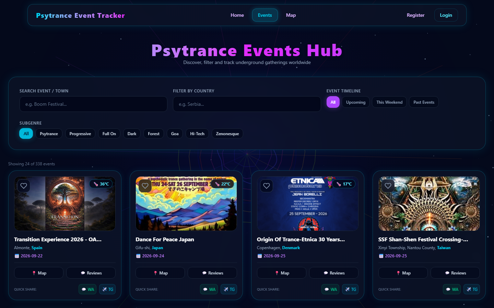
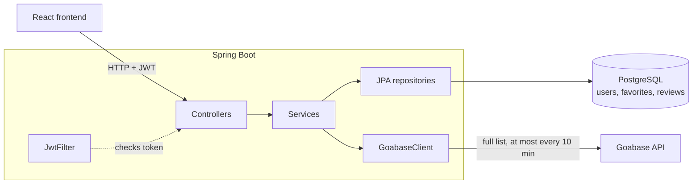

# PsyTrance Event Tracker — Backend

[](https://github.com/Peconjii/psytrance-tracker-backend/actions/workflows/ci.yml)

REST API for **PsyTrance Event Tracker**, a web app for discovering psytrance festivals and parties around the world.
It pulls events from the public [Goabase](https://www.goabase.net) API, serves them searchable and paginated,
and lets users register, save favorite events and write reviews.

**Frontend (React):** [Peconjii/psytrance-tracker](https://github.com/Peconjii/psytrance-tracker)



## Tech stack

- **Java 17**, **Spring Boot 4** — Web MVC, Security, Data JPA, Validation, Mail
- **PostgreSQL** with **Hibernate / JPA** and **Flyway** migrations
- **JWT** authentication (JJWT) with **BCrypt** password hashing
- Spring **RestClient** for the Goabase integration
- **JUnit 5**, **Mockito**, **AssertJ**, **Testcontainers**, **MockMvc**
- **GitHub Actions** CI
- **Maven**
- **Docker** / Docker Compose

## Architecture



Requests go through the usual layers: **controller** (HTTP, validation) → **service** (business logic) →
**repository** (database) or **client** (external API).

### Design decisions

- **Server-side search and paging over a cached snapshot.** Goabase has no paging, only a `limit`.
  `EventService` downloads the full list at most once every 10 minutes, then filters, sorts and pages it
  in memory. This keeps responses fast and avoids hammering Goabase. If a refresh fails, the last good list
  keeps being served instead of an error.
- **One class talks to Goabase.** `GoabaseClient` owns the URLs, timeouts and JSON shape, and maps responses
  into typed records. The rest of the app never sees Goabase's raw format. Redirects are disabled on purpose:
  Goabase answers an unknown event id with a `301` to an HTML page, which the client turns into "not found".
- **Testable time.** Date logic ("upcoming", "this weekend") uses an injected `java.time.Clock`, so tests can
  pin "today" to a fixed date and move time forward to test cache expiry.
- **Stateless auth.** Login returns a signed JWT; every protected request is authenticated from its
  `Authorization: Bearer` header. Users can only read and change their own favorites.
- **Password reset without leaking accounts.** Reset links carry a random 256-bit token; only its SHA-256
  hash is stored, it expires after 30 minutes and works once. The endpoint answers identically for known and
  unknown emails, so it can't be used to discover who has an account.
- **Schema changes as versioned SQL.** Flyway migrations in `src/main/resources/db/migration` own the database
  schema, and Hibernate only validates that the entities match it (`ddl-auto=validate`). Every database (local,
  Docker, tests, production) goes through the same numbered steps, which are reviewed in git like any other code.
  Moving off `ddl-auto=update` also surfaced a real gap: it had never added the unique constraint on usernames
  to the existing table, which `V2__unique_username.sql` now does.
- **Consistent errors.** A `@RestControllerAdvice` turns validation failures, conflicts, missing events and
  Goabase outages into JSON responses with the right status code (`400`, `404`, `409`, `503`).

## API

| Method | Endpoint | Auth | Description |
|---|---|---|---|
| `POST` | `/api/auth/register` | – | Create an account (`username`, `email`, `password`) |
| `POST` | `/api/auth/login` | – | Returns `{ "token": "..." }` |
| `GET` | `/api/auth/me` | ✔ | Current user |
| `POST` | `/api/auth/forgot-password` | – | Email a one-time reset link (`email`); same answer whether or not the account exists |
| `POST` | `/api/auth/reset-password` | – | Set a new password with the link's token (`token`, `newPassword`) |
| `GET` | `/api/events` | – | Paged, filtered event list (see below) |
| `GET` | `/api/events/map` | – | All events that have coordinates, for the map |
| `GET` | `/api/events/{id}` | – | One event |
| `GET` | `/api/favorites/{userId}` | ✔ own | User's favorites |
| `POST` | `/api/favorites/{userId}` | ✔ own | Add favorite (`eventId`, `eventName`) |
| `DELETE` | `/api/favorites/{userId}?eventId=` | ✔ own | Remove favorite |
| `POST` | `/api/reviews` | ✔ | Add or update your review of an event (`eventId`, `rating` 1–5, `comment`) |
| `GET` | `/api/reviews/event/{eventId}` | – | Reviews of an event |
| `GET` | `/api/reviews/user` | ✔ | Your reviews |

### `GET /api/events`

| Parameter | Default | Description |
|---|---|---|
| `page` | `0` | Page number, starting at 0 |
| `size` | `24` | Page size, 1–100 |
| `search` | – | Matches event name or town |
| `country` | – | Matches country name |
| `genre` | – | Matches event type or name, e.g. `Forest` |
| `timeline` | `ALL` | `ALL`, `UPCOMING`, `THIS_WEEKEND` or `PAST` |

```http
GET /api/events?page=0&size=2&country=spain&timeline=UPCOMING
```

```json
{
  "content": [
    {
      "id": 115531,
      "nameParty": "Transition Experience 2026 - OA Psytrance Festival",
      "nameTown": "Almonte",
      "nameCountry": "Spain",
      "nameType": "Open Air",
      "nameStatus": "Scheduled",
      "dateStart": "2026-09-22",
      "dateEnd": "2026-09-28",
      "urlImageMedium": "https://img.goabase.net/...",
      "urlPartyHtml": "https://www.goabase.net/party/...",
      "lat": 37.3,
      "lon": -6.5
    }
  ],
  "page": 0,
  "size": 2,
  "totalElements": 7,
  "totalPages": 4,
  "hasNext": true
}
```

## Quick start with Docker

The fastest way to run everything (database, backend and frontend) is Docker Compose. Clone both repos next
to each other:

```bash
git clone https://github.com/Peconjii/psytrance-tracker-backend.git
git clone https://github.com/Peconjii/psytrance-tracker.git

cd psytrance-tracker-backend
docker compose up --build
```

Then open **http://localhost:5173**. The API is on `http://localhost:8080`, and the data lives in a Docker
volume, so it survives restarts (`docker compose down -v` wipes it).

The database password and JWT secret in `docker-compose.yml` are throwaway values for this local setup.

## Running locally without Docker

**You need:** JDK 17+ and a PostgreSQL database (local, or hosted such as Supabase).

The app reads its configuration from environment variables. Nothing secret is stored in the repository.

| Variable | Example |
|---|---|
| `DB_URL` | `jdbc:postgresql://localhost:5432/psytrance` |
| `DB_USERNAME` | `postgres` |
| `DB_PASSWORD` | your database password |
| `JWT_SECRET` | at least 32 characters, e.g. from `openssl rand -base64 48` |

```bash
export DB_URL=jdbc:postgresql://localhost:5432/psytrance
export DB_USERNAME=postgres
export DB_PASSWORD=secret
export JWT_SECRET=$(openssl rand -base64 48)

./mvnw spring-boot:run
```

In IntelliJ, set the same variables under *Run → Edit Configurations → Environment variables*.

**Email (optional).** Password reset emails are sent over SMTP when these are set:

| Variable | Example (Gmail) |
|---|---|
| `SPRING_MAIL_HOST` | `smtp.gmail.com` |
| `SPRING_MAIL_PORT` | `587` |
| `SPRING_MAIL_USERNAME` | `you@gmail.com` |
| `SPRING_MAIL_PASSWORD` | a Gmail [app password](https://myaccount.google.com/apppasswords), not your normal password |
| `MAIL_FROM` | `you@gmail.com` |
| `FRONTEND_URL` | `http://localhost:5173` (default), used to build the reset link |

Without `SPRING_MAIL_HOST`, the reset link is written to the application log instead, which is enough for
local development.

The API starts on `http://localhost:8080`. On first start, Flyway creates the tables from the SQL migrations.
CORS allows the frontend dev server at `http://localhost:5173`.

## Tests

```bash
./mvnw test
```

Docker must be running: the integration tests start a throwaway PostgreSQL container with
[Testcontainers](https://testcontainers.com). No other setup or environment variables are needed.
GitHub Actions runs the same tests on every push.

**Unit tests** check one class on its own. Its dependencies are mocked, and time is controlled with a fake `Clock`.

- `EventServiceTest`: paging, sorting, search, timeline filters and the cache (one fetch while fresh, refresh
  after expiry, old list kept when Goabase is down)
- `PasswordResetServiceTest`: unknown emails send nothing, only the token hash is stored, a link works once,
  expired or made-up links are rejected

**Integration tests** start the whole application with real security and a real PostgreSQL, and call the API
through MockMvc. Only Goabase is faked.

- `AuthIntegrationTest`: register, log in, `/me`; passwords stored as BCrypt hashes and never returned;
  duplicate usernames, validation errors, wrong passwords, missing or invalid tokens
- `FavoriteIntegrationTest`: add, list, remove; duplicates are a `409`; **users can't read or change someone
  else's favorites** (`403`)
- `ReviewIntegrationTest`: reading is public, writing needs login, a second review updates the first,
  rating must be 1–5
- `EventApiIntegrationTest`: paging, filters, invalid parameters, unknown events, Goabase outages

## Roadmap

- [x] Docker Compose setup (PostgreSQL + backend + frontend)
- [x] Integration tests with Testcontainers
- [x] GitHub Actions CI
- [x] Flyway migrations instead of `ddl-auto=update`
- [ ] Deployment to AWS

## Credits

Event data from [Goabase](https://www.goabase.net).
